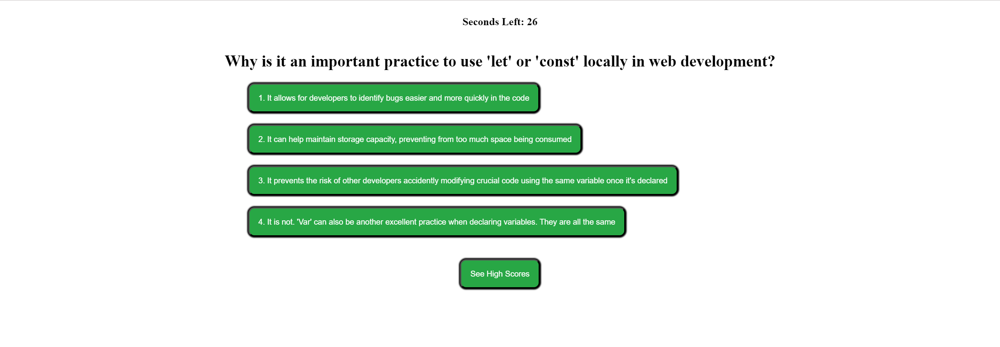

# Quiz-Biz

## User Story

```
AS A coding boot camp student
I WANT to take a timed quiz on JavaScript fundamentals that stores high scores
SO THAT I can gauge my progress compared to my peers
```

## Acceptance Criteria

```
GIVEN I am taking a code quiz
WHEN I click the start button
THEN a timer starts and I am presented with a question
WHEN I answer a question
THEN I am presented with another question
WHEN I answer a question incorrectly
THEN time is subtracted from the clock
WHEN all questions are answered or the timer reaches 0
THEN the game is over
WHEN the game is over
THEN I can save my initials and my score
```

## Objective

From scratch, create a quiz game at which a timer will initiate as soon as the user clicks start. Once the user begins the quiz, the timer will countdown until zero, and there will be a 20 second deduction in seconds if the user answers a question incorrectly. Once the user has successfully answered all questions or the timer hits 0, the results page will display indicating the user's total seconds left, in which this will be used to be saved to local storage, and be compared with other saved high scores. The user will be required to enter their initials to submit the scores they have received after the game finishes.



## Link to Website

https://dcollan.github.io/quiz-biz/

## How to Run

1. Run 'git clone (repo link)' on Git Bash'
2. CD into project directory
3. Run project via code editor (e.g. Visual Studio Code)
4. Navigate to index.html
5. Right click on file, and click 'Open in Default Browser' to view project in browser
